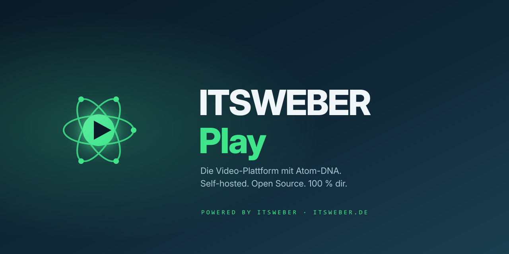

<p align="center">
  
</p>

# ITSWEBER Play

[](https://www.gnu.org/licenses/agpl-3.0)


> Eigene, maximal anpassbare Video-Plattform als Single-Container-Docker-Stack. Greenfield-Alternative zu PeerTube/MediaCMS — mit 6-Ebenen-Theming-System, First-Run-Setup-Wizard und Multi-Creator-Backend.

**Produkt:** ITSWEBER Play · <https://play.itsweber.net>
**Hersteller:** [ITSWEBER](https://itsweber.de) · Benjamin Weber
**Lizenz:** AGPL-3.0 — Nutzung und Weitergabe erlaubt, Urheber-Attribution ist Pflicht.

&copy; 2026 Benjamin Weber · ITSWEBER

## Features

- **Next.js 15** (App Router, RSC) · **Fastify + tRPC** · **BullMQ + FFmpeg + yt-dlp** · **PostgreSQL 16** · **Redis 7** · **MinIO**
- Multi-Creator (Default-Rolle `CREATOR`), eigene Channels, Playlists, Shorts
- Video-Pipeline: Transcoding, Thumbnails, Captions (whisper.cpp)
- 6-Ebenen-Theming über `packages/theme/tokens.json` — Live-Editor im Admin
- First-Run-Setup-Wizard (`/setup`) mit Admin, Branding, SMTP, Legal, Theme
- Sichtbarkeits-Enum `public | unlisted | private | logged_in`

## Quickstart (Prod — All-in-One-Container)

Ein einziger Container bündelt Postgres, Redis, MinIO, Web, API, Worker
hinter s6-overlay. Nur Port **3000** exposed, alle Daten unter `/data`.

```bash
docker run -d \
  --name itsweber-play \
  -p 3000:3000 \
  -v play-data:/data \
  --env-file .env.all-in-one \
  ghcr.io/itsweber-official/itsweber-play:latest
```

Beim ersten Aufruf `http://<host>:3000` startet automatisch der Setup-Wizard
unter `/setup` — Admin anlegen, Branding + SMTP + Legal konfigurieren, fertig.

Details zu Unraid-Deploy: [docs/02-deployment-unraid.md](docs/02-deployment-unraid.md)

## Quickstart (Dev)

```bash
cp .env.example .env           # Secrets eintragen
docker compose -f docker-compose.dev.yml up -d --build
# oder: make dev
```

Web-UI: <http://localhost:3000> · API: <http://localhost:4000> · MinIO: <http://localhost:9001>

## Architektur

```text
NPM (Reverse Proxy)
   │
   ▼  play.itsweber.net → :3000
┌───────────────────────────────────────────┐
│  Single Container (s6-overlay)            │
│  ├─ Nginx     :3000  (Reverse-Proxy)      │
│  ├─ Web       :3100  (Next.js 15)         │
│  ├─ API       :4000  (Fastify + tRPC)     │
│  ├─ Worker           (BullMQ + FFmpeg)    │
│  ├─ Postgres  :5432                       │
│  ├─ Redis     :6379                       │
│  └─ MinIO     :9000                       │
└───────────────────────────────────────────┘
         │
         ▼   /data  (Postgres + Redis + MinIO)
```

Vollständig: [docs/01-architecture.md](docs/01-architecture.md)

## Feature-Stand

Siehe [docs/07-features-matrix.md](docs/07-features-matrix.md) und [docs/09-roadmap.md](docs/09-roadmap.md).

## Contributing · Security

- [CONTRIBUTING.md](CONTRIBUTING.md) — Entwicklungsflow, Commit-Style, Tests
- [SECURITY.md](SECURITY.md) — Sicherheitslücken melden

## Lizenz

[GNU AGPL-3.0](LICENSE) — Wenn du diese Software auf einem Server betreibst
und Nutzern darüber Dienste anbietest, musst du deinen Quellcode den
Nutzern zur Verfügung stellen (Affero-Klausel).
